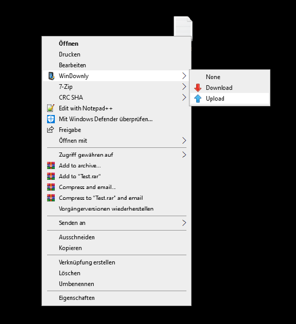
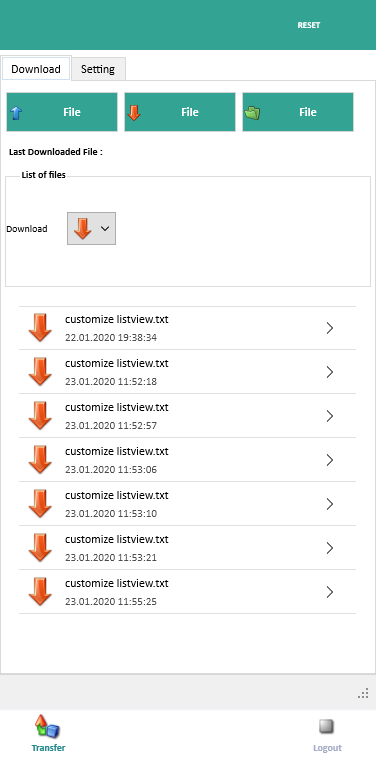

# WinDownly 
- WinDownly is a Software that deliver a easy method to wirelessly transfer files between your Android device and your Desktop.

**Authors:**  *WalWalWalides*
------

`WinDownly` help to easily transfer Files from pc to android app.

- Principal Software Benefits:

     - Transfer any extension Files using udp as transfer protocol
     
     - Auto create a shortcut using windows shell
     
     - Receive a notification in your android App after every success downloading
     
     - Upload and download files through wireless communication
     
     
     

## Built With

* [ExecutionMaster](https://github.com/diversenok/ExecutionMaster) - ExecutionMaster Library by ( diversenok )
* [RealThinClient SDK](https://rtc.teppi.net/download/) - RealThinClient Library    

### Main View

------

### Android View (WinDownly V 1.0.0 )

------

## Contains

| File | Contents | 
| --- | --- |
| .gitignore | Git ignores the Files in this File |
|[WinDownly.exe](https://github.com/walwalwalides/WinDownly/releases/download/WinDownlyPC/WinDownly__Setup.exe)| Download WinDownly for (PC).
|[WinDownly.apk](https://github.com/walwalwalides/WinDownly/releases/download/WinDownlyAndroid/WinDownly.apk)| Download WinDownly for (Android).
| README.md | The Readme for this Project|

------

# If You Want To Donate!

